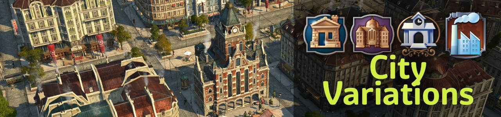
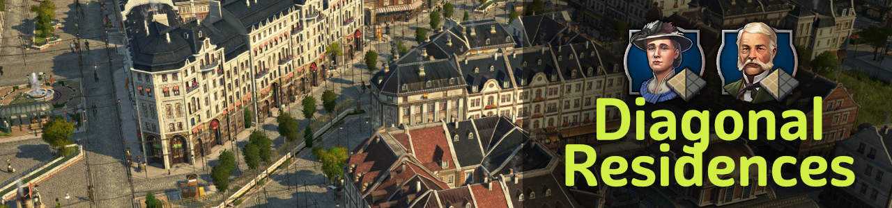
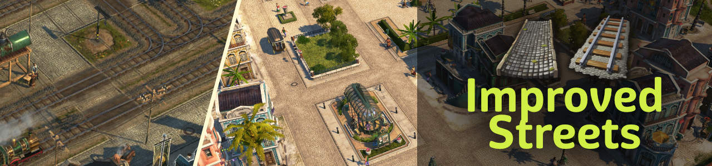
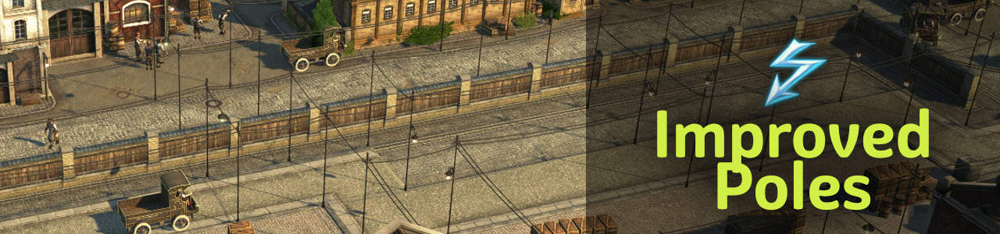

# Jakob's City Variations

New population tiers, products, industries and tons of new visual assets (custom models, skins, ...).

## How to Get

These are your options:

- Subscribe at [Mod.io](https://mod.io/g/anno-1800/u/jakobscollection)
- [Install manually](https://github.com/jakobharder/anno1800-mod-loader#mods) with downloads from [Mod.io](https://mod.io/g/anno-1800/u/jakobscollection) or [GitHub releases](https://github.com/jakobharder/anno-1800-jakobs-mods/releases).

## Changes

All mods are compatible previous versions and can be added to existing savegames.
Smaller rebalancing may happen and will be listed in the changelogs for you to adjust.

## `Jakob's City Variations`

Add more variety to your cities with skins, variations and non-gameplay changing buildings.

### Buildings

- Small Hotel OW, 4 variants and many skins
- Small Hotel NW, if played with [New World Tourism](https://github.com/anno-mods/New-World-Tourism)
- Small Post Office

- 3x3 Department, Furniture and Drug Store
- 3x3 Store Warehouse (+ skins for all mall types)
- 3x3 Ornamental mall (+ skins for all mall types)
- 3x3 Restaurant, Cafe and Bar

### Skins

- Town hall:
  adds 3 red brick town halls, the "new town hall" and two smaller town hall skyscrapers.
- Guild house: higher guild house with 2 color skins
- Residences:
  skins for normal and diagonal residences.
  Use less video memory for better performance than the Colour Collection, but is mostly only roof changes.
- Hotel, also in the NW if played with [New World Tourism](https://github.com/anno-mods/New-World-Tourism)
- Factory variants:
  adds Shift+V variations to vanilla production buildings.

### Ornaments

- Diagonal enclosed greenery on plaza and stone pavement
- Skins with diagonal and other corner variations for fences and park paths

## `Diagonal Residences (Jakob)`

### Buildings

- Diagonal and narrow 3x1 engineers + 3 custom roof skins
- Diagonal and narrow 3x1 investors + 4 custom roof skins
- Vibrant Cities skins are supported
- Additionally, skins matching jje1000's red tile roof buildings for engineers

### Ornaments

- Diagonal enclosed greenery on plaza and stone pavement
- Skins with diagonal and other corner variations for fences and park paths

You might be interested in [jje1000's Diagonal Roads](https://www.nexusmods.com/anno1800/mods/164) as well.

## `Improved Streets (Jakob)`

Replaces railroads and NW streets with more fitting textures.

### Textures

- More sandy NW stone street
- Wider railway texture to fit both cities and rural areas

## `Improved Poles (Jakob)`

Replaces electric wires and poles with lighter, less distracting models.

## Build and Modify Yourself

The mods are made with the [Modding Tools for Anno](https://marketplace.visualstudio.com/items?itemName=JakobHarder.anno-modding-tools) extension for [VS Code](https://code.visualstudio.com/).
Install the plugin, open a mod folder and press `F1` and choose `Build Anno Mod`.

## Translations

I appreciate feedback if you encounter wrong or missing translations.
Easiest way to contact is @jakob in the modding discord (or Annoverse).

## Credits

- Taubenangriff, Lordys, Drakkam for sharing some graphic assets
- Kurila for improvements on compact UI, shared products and extra goods
- m_belonosov, redzmey1, DrD_AVEL for Russian translations
- MSHS for Korean translations
- Tonton Yip, Petritant, Water for French translations
- HeroOfOlympus, Aveneger432 for Polish translations
- darknesswei for Chinese translation
- mfuegar for Spanish translations
